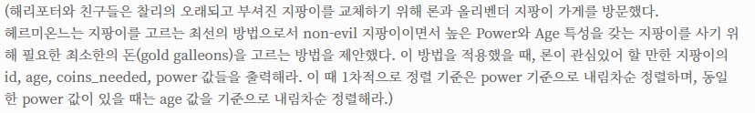

# Ollivander's Inventory

## 😎 번역


Answer

1. id, age, coins_needed, power of the wands 출력하기
2. age와 power가 같은 것이 여러개라면 그 중 coins_needed 값이 가장 작은 것을 출력하기
3. is_evil 값이 0이어야 함
4. power순으로 내림차순, power가 같다면 age순으로 내림차순 하기

## 🤖 배운것

- having은 그룹화된 그룹들에 조건을 거는 것이다.
- 집계 함수는 group에서 선택된 행을 제외한 나머지 한개의 행만 사용가능하다!

# 올바른 코드

```mysql
SELECT B.AGE , min(A.COINS_NEEDED) , A.POWER <- 하나만 쓰기!>

GROUP BY B.AGE,A.POWER
```

# 잘못된 코드

```mysql
SELECT A.ID ,B.AGE , min(A.COINS_NEEDED) , A.POWER

GROUP BY B.AGE,A.POWER

```
